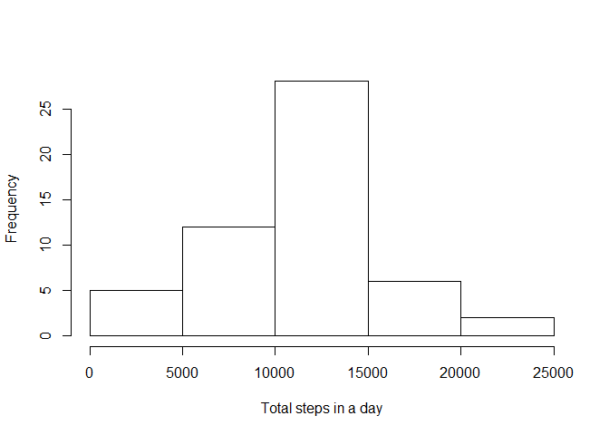
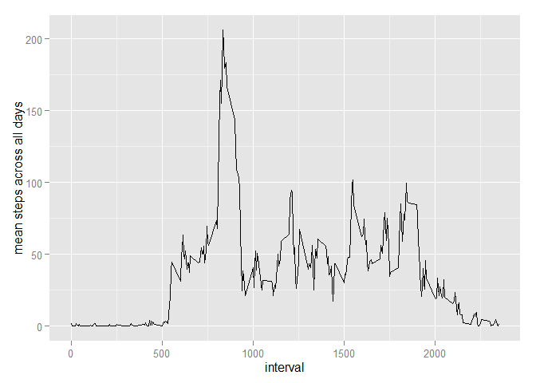
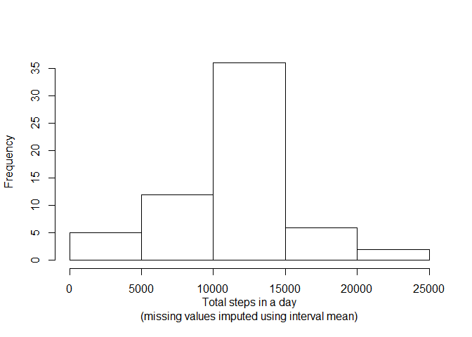
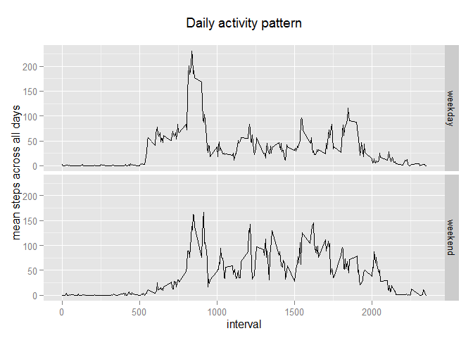

# Reproducible Research: Peer Assessment 1


## Loading and preprocessing the data

```r
library(dplyr)
library(ggplot2)
```

```r
unzip("activity.zip")
act <- read.csv("activity.csv")
steps.all <- summarize(group_by(act,date),
                  mean=mean(steps,na.rm=TRUE),
                  min=min(steps,na.rm=TRUE),
                  max=max(steps,na.rm=TRUE),
                  total=sum(steps,na.rm=TRUE),
                  count=sum(!is.na(steps))
                  )
steps.all <- mutate(steps.all,mon=ifelse(as.Date(date)<as.Date("2012-11-01"),10,11))
steps <- filter(steps.all, count>0)
all.missing <- sum(steps.all$count==0)
all.days <- dim(steps.all)[1]
steps.by.interval <- summarize(group_by(act,interval),
                  mean=mean(steps,na.rm=TRUE),
                  min=min(steps,na.rm=TRUE),
                  max=max(steps,na.rm=TRUE),
                  total=sum(steps,na.rm=TRUE),
                  count=sum(!is.na(steps))
                  )
steps.by.interval <- filter(steps.by.interval, count>0)
```
The data set has no data at all for 8 of the 61 days. Data preparation includes summarizing by date, then removing days with no data. The histogram of steps per day gives an overview of the individual's monitored activity.

```r
hist(steps$total,xlab="Total steps in a day",main="")
```

 

## What is mean total number of steps taken per day?
The five-number summary below includes the mean and median steps per day.

```r
summary(steps$total)
```

```
##    Min. 1st Qu.  Median    Mean 3rd Qu.    Max. 
##      41    8841   10760   10770   13290   21190
```

## What is the average daily activity pattern?

```r
qplot(x=steps.by.interval$interval,y=steps.by.interval$mean,geom="line",ylab="mean steps across all days",xlab="interval","Daily activity pattern")
```

 

```r
peak <- steps.by.interval[which(steps.by.interval$mean==max(steps.by.interval$mean)),]
```
The individual's peak activity, by average steps across all days in the study, occurred at 08:35. Averaged across the days of the study, 206 steps were recorded in that interval.

## Imputing missing values

```r
missing.steps = sum(is.na(act$steps))
missing.total = sum(is.na(act))
percent.missing.in.steps = round(100*missing.steps/missing.total)
```
The input dataset has a total of 2,304 NA values, 100% of which occur in the steps column. Since there are some days with no data, we will estimate a replacement for an NA value by using the individual's mean activity in that interval over the entire study period.

```r
# use the overall mean to impute steps
impute <- function(i) {
    mean(act[act$interval==i,]$steps,na.rm=TRUE)
}

# compute these once instead of many times
imputations <- sapply(1:288,function(i){ impute(act$interval[i]) })

# attach to the dataset
act.imputed <- cbind(act,rep(imputations,61))

# adjust the column names
colnames(act.imputed)[length(colnames(act.imputed))] <- "imputed"

# replace NAs with the interval means
act.imputed <- mutate(
    act.imputed,
    imputedsteps = ifelse(is.na(steps), imputed, steps)
)

# summarize
steps.imputed <- summarize(
    group_by(act.imputed,date),
    total=sum(imputedsteps)
)
```
This histogram of total steps in a day, after imputing values to the NAs, closely resembles the original histogram that was created by dropping NA values.

```r
hist(
    steps.imputed$total,
    xlab="Total steps in a day\n(missing values imputed using interval mean)",
    main=""
)
```

 

The five-number summary below includes the mean and median steps per day, after imputing the NA values. Compared to the values before imputing missing values, the mean has not changed, and the median has changed very slightly.

```r
summary(steps.imputed$total)
```

```
##    Min. 1st Qu.  Median    Mean 3rd Qu.    Max. 
##      41    9819   10770   10770   12810   21190
```
## Are there differences in activity patterns between weekdays and weekends?
Based on the dataset with interval means used in place of the original NA values, this panel plot is intended to help with comparing the individual's activity pattern on weekends vs weekdays.

```r
act.imputed <- cbind(
    act.imputed,
    ifelse(weekdays(as.Date(act.imputed$date)) %in% c("Saturday","Sunday"),"weekend", "weekday")
)

colnames(act.imputed)[length(colnames(act.imputed))] <- "weekpart"

steps.imp.int <- summarize(
    group_by(act.imputed,interval,weekpart),
    mean=mean(imputedsteps)
)
    
p <- ggplot(steps.imp.int,aes(interval,mean)) + geom_line() + facet_grid(weekpart~.) +
    ylab("mean steps across all days") + ggtitle("Daily activity pattern\n")
print(p)
```

 

On weekends, the individual's activity shifts later in the day. The sharp increase in steps that occurs around 5:30am is not present on the weekend. The daily activity peak is still around 8:30am on weekends, but it is only slightly more than at later times of the day. By contrast, the 8:30 peak on weekdays has roughly twice as many steps as the afternoon and evening peaks.
